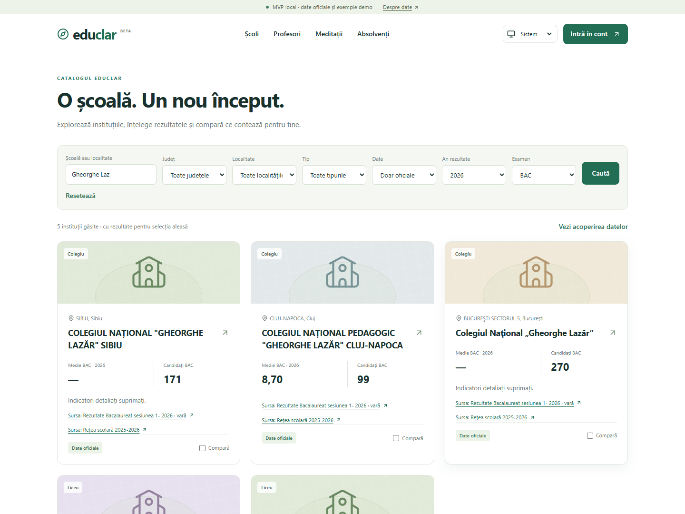
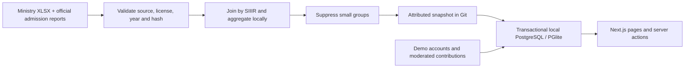

<p align="center"></p>

<p align="center">
  <a href="https://github.com/Arch0zn-domain/iubesc-mamele/actions/workflows/verify.yml"></a>
  
  
  
  
</p>

<p align="center"><a href="#getting-started">Run the demo</a> · <a href="#official-education-data-and-attribution">Explore the data</a> · <a href="#checks-and-tests">Verification</a> · <a href="https://github.com/Arch0zn-domain/iubesc-mamele/issues/4">Delivery tracker</a></p>

# EduClar

**Data with context. People with a voice. A clearer next step in education.**

EduClar is a Romanian-language education platform prototype for exploring schools, comparing academic results, discovering teachers, and connecting with tutors. It brings school information, moderated community reviews, and alumni stories into one place.

> **Local prototype:** the school catalog includes official institutions and aggregate exam results alongside clearly labeled fictional demo data. Authentication uses simulated SMS codes. Live mode is intentionally disabled.

## Why EduClar

Choosing a school requires more than a single average. EduClar connects official results with their year, cohort and source, then adds separate, moderated perspectives from teachers, students, parents and alumni. The interface is Romanian, accessible on mobile, and supports light, dark and system themes.



## Features

- **School discovery:** search without Romanian diacritics, filter the catalog, filter by exam and year, explore results by session, and compare up to three schools.
- **Teacher profiles and reviews:** separate classroom and tutoring feedback, profile claims, verification, and moderation. Scores appear after at least five approved reviews in the same context.
- **Accounts and guardianship:** phone-code sign-in, role-based access, parent–child links, guardian invitations, contribution authorization, and withdrawal.
- **Tutoring:** claimed teachers can publish offers and accept or decline requests. Contact details become available privately after acceptance.
- **Alumni stories:** adult alumni can publish or withdraw their profiles; profiles remain private until publication.
- **Administration:** review verification evidence, moderate reviews and replies, handle reports and privacy requests, and validate and publish JSON imports.
- **Preferences and transparency:** light, dark, and system themes; cookie preferences; methodology, terms, privacy, and cookie pages.

## Tech stack

| Area | Tools |
| --- | --- |
| Application | Next.js 16 App Router, React 19, TypeScript |
| Styling and icons | Tailwind CSS 4, Lucide React |
| Database | PGlite for local PostgreSQL, Drizzle ORM; optional PostgreSQL connection via `pg` |
| Authentication and validation | Better Auth, Zod |
| Testing | Vitest, Playwright |

## Getting started

On Windows, after installing dependencies, double-click **[START-SERVER.cmd](START-SERVER.cmd)**. The server starts in the background, writes logs, verifies HTTP health, and opens the browser. See **[SERVER.md](SERVER.md)** for status, safe stop, alternate ports and production mode.

Install **Node.js 22 or newer** and npm, then run these commands from the repository root:

```sh
npm ci
npm run dev
```

Open [http://127.0.0.1:3000](http://127.0.0.1:3000).

The first request applies database migrations, seeds demo accounts, and installs the included official-data snapshot. PGlite runs locally without Docker or a separate database server. Runtime data and generated local secrets are stored in `.data/`, which Git ignores.

Only run one process against a given PGlite database directory. Stop the app before running database checks or CLI imports.

### Configuration

The defaults work without an environment file. For overrides, copy [`.env.example`](.env.example) to `.env.local` and adjust the relevant values:

| Variable | Default / behavior |
| --- | --- |
| `APP_MODE` | `local`; live mode refuses to start |
| `BETTER_AUTH_URL` | `http://127.0.0.1:3000`; must match the browser address and use a loopback host |
| `DATA_DIR` | `.data` |
| `BETTER_AUTH_SECRET` | Generated and saved locally when omitted |
| `DOCUMENT_KEY` | Generated locally when omitted; an explicit value uses 64 hexadecimal characters |
| `DATABASE_URL` | Unset; provide a PostgreSQL connection string to use PostgreSQL instead of PGlite |

For a different port, update `BETTER_AUTH_URL` to match the URL used in your browser. Shell commands such as database checks and imports read environment variables from the process; set any overrides in your shell when running them.

### Run a production build locally

```sh
npm run build
npm start
```

This uses Next.js's production build while keeping the application in local demo mode.

## Try the demo

Visit `/autentificare`, choose a demo role, request a code, and click the displayed local code to fill it in. No SMS is sent.

| Fictional phone number | Role |
| --- | --- |
| `+40700000001` | Administrator |
| `+40700000002` | Parent |
| `+40700000003` | Student aged 16+ |
| `+40700000004` | Teacher with a claimed profile |
| `+40700000005` | Child with a guardian |
| `+40700000006` | Alumnus |
| `+40700000007` | Moderator |

The demo student has classroom verifications for Ana Popescu for the 2025–2026 school year. The demo family has verifications for Sorin Luca. Administrators can explore approval workflows at `/admin`; moderators have access to moderation and reports only.

| Route | Purpose |
| --- | --- |
| `/scoli` | School catalog and filters |
| `/compara` | School comparison |
| `/profesori` | Teacher directory and profiles |
| `/meditatii` | Tutoring offers and requests |
| `/absolventi` | Published alumni profiles |
| `/cont` | Account and contribution workflows |
| `/admin` | Administration and moderation |
| `/date` | National coverage, yearly counts, missing resources and catalog shortcuts |
| `/metodologie` | Data and review methodology |
| `/solicitari` | Public privacy request form |

## Checks and tests

Local verification on **4 October 2026**: TypeScript and the production build pass; **19** domain/service/snapshot tests, **11** Python importer checks and **13** browser scenarios pass. Browser tests use an isolated database and a separate port; the normal demo database is preserved. GitHub Actions reruns these checks for pushes and pull requests.

```sh
npm run typecheck
npm test
npm run build
npm run test:e2e
```

Server tests use separate temporary databases. Browser tests run against a local production build on port 3000 with a separate database at `.data/browser-test`. Build first and stop your existing server before running them so Playwright uses the isolated test environment. Alternatively, set `PLAYWRIGHT_PORT` in your shell to an unused port; tests then use a separate database at `.data/browser-test-<port>` and never reuse a running application server.

On Windows, browser tests use installed Microsoft Edge. On other platforms, install Chromium first:

```sh
npx playwright install chromium
```

Browser coverage includes navigation, cookie and theme preferences, school search and comparison, privacy requests, authentication, review moderation, and tutoring acceptance. Screenshots and retained failure traces are written to `test-results/`.

## Database checks and imports

With the app stopped:

```sh
npm run db:check
npm run import:json -- schools examples/schools-demo.json demo
```

The import command stages a batch for validation and review. Publish it from `/admin`, or append `--publish` to the command. Supported import types are `schools`, `teachers`, and `statistics`.

The [example import](examples/schools-demo.json) uses the synthetic `demo` source. For additional sources, register the publisher, HTTPS URL, year, and reuse conditions, validate the source, then upload normalized JSON.

### Official education data and attribution

The included aggregate-only snapshot contains 6,932 institutions from the 2025–2026 school network and BAC/EN history for 2023–2026, with available admission reports for 2025–2026. See the coverage table below.

| Coverage | Included records |
| --- | ---: |
| Institutions in all 41 counties and Bucharest | **6,932** |
| BAC school cohorts, 2023–2026 | **5,583** |
| EN school cohorts, 2023–2026 | **22,182** |
| Admission specializations, 2025–2026 | **8,653** |
| All cohorts and specializations | **36,418** |
| Groups with detailed indicators visible | **10,089** |

The remaining 26,329 groups retain only permitted cohort information; detailed indicators are suppressed. Admission specialization endpoints checked for 2023/2024 returned HTTP 404, so those years are explicitly unavailable. One 2025 source reports 79 occupied places against 78 advertised; the published occupied count is preserved and the discrepancy is disclosed on `/date`.

Data is joined by SIIIR codes; unmatched records are excluded and their counts are disclosed on `/metodologie`. Kindergartens and unsupported institution types are outside this catalog. Enrollment counts remain unknown when the source does not provide them.

- [School network 2025–2026](https://data.gov.ro/dataset/retea-scolara-2025-2026), [BAC session 1, 2026](https://data.gov.ro/dataset/rezultate_bacalaureat_2026), and [EN 2026](https://data.gov.ro/dataset/rezultate_evaluare_2026): Ministry of Education datasets on data.gov.ro, licensed under [CC BY 4.0](https://creativecommons.org/licenses/by/4.0/). EduClar normalizes and aggregates these files.
- Historical Ministry files: BAC [2023](https://data.gov.ro/dataset/rezultate-bacalaureat-2023-sesiunea-1), [2024](https://data.gov.ro/dataset/rezultate_bacalaureat), [2025](https://data.gov.ro/dataset/rezultate-bacalaureat-sesiunea-iunie-2025); EN [2023](https://data.gov.ro/dataset/rezultatele-la-evaluarea-nationala-2023), [2024](https://data.gov.ro/dataset/evaluare_nationala_24), [2025](https://data.gov.ro/dataset/rezultate_evaluare_2025). Exact resource IDs, years and SHA-256 hashes are recorded in the snapshot.
- Official portals: [Bacalaureat](https://static.bacalaureat.edu.ro/2026/), [Admitere](https://static.admitere.edu.ro/2026/repartizare/index.html), and [Evaluare Națională](https://static.evaluare.edu.ro/2026/). Admission statistics use published specialization-level occupied places and current-year minimum grades; the portal does not specify a CC BY license.
- [Plusedu](https://www.plusedu.ro/) is an independent reference, cited separately. Its content, images, and database are not copied into this project.

Sources appear on school cards, detail pages, comparisons, and `/metodologie`, alongside the year/session and coverage limitations. Detailed statistics for small cohorts are removed before the snapshot is saved. Candidate identifiers and individual records are never included in the snapshot or application database. The historical BAC `Neevaluat` status has no numeric average and is not converted to zero. BAC means include available final published averages and, for failed candidates without a published average, complete final written marks after appeals; the calculation and denominator are explained on `/metodologie`.

Refresh the snapshot with Python 3 (standard library only), then restart the application. Verified source IDs and content hashes prevent accidentally importing another year or silently accepting changed files:

```sh
npm run data:refresh
# Optional: import only a selected verified year
npm run data:refresh -- --years 2026
python tests/official_import_test.py
```

The refresh downloads complete XLSX files, validates the publisher/license and expected headers, reads all rows, fetches available specialization reports for all 41 counties and Bucharest, and replaces `data/official/snapshot.json` only after success. Resource URLs, SHA-256 hashes, retrieval time, and coverage counts are retained. Raw XLSX downloads stay in the Git-ignored `.data/source-cache/`; only the attributed aggregate snapshot is committed. No network access is needed during app startup; the snapshot is installed transactionally once per changed file or installer revision. Removed managed cohorts leave the database; retired institutions leave the public catalog while their IDs and account/teacher references remain intact. Demo-only service tests use separate databases; browser catalog tests explicitly select demo data.

## Architecture



The app starts from the included snapshot without contacting external data servers. Official school statistics, fictional demo fixtures and private account workflows are distinct.

## Project structure

```text
src/
  app/          Pages, API routes, and server actions
  components/   Shared interface components and forms
  lib/          Authentication, database, domain logic, imports, and seed data
migrations/     SQL migrations
scripts/        Official fetch/aggregate pipeline, DB/JSON tools and Windows launcher
data/official/  Attributed school and aggregate exam snapshot
tests/          Domain and service tests, plus browser flows
examples/       Sample import data
```

## Prototype limitations

This project is intended for local exploration with official aggregate data and fictional demo accounts. Do not upload real personal documents to the demo.

- SMS delivery, payments, bookings, real-time chat, and automatic data exports are not implemented.
- The operator identity and contact details in `src/lib/legal.ts` are fictional. Public privacy requests are recorded locally; no emails are sent, and requests require manual review and response.
- Verification evidence is private and encrypted. After resolution, evidence is removed during a subsequent cleanup triggered by account use or actions; there is no independent scheduled cleanup worker.
- Account deletion and profile withdrawal are distinct operations. Minimal logs and technical references remain; a complete retention policy is still needed for launch.
- `APP_MODE=live` deliberately refuses to start. Real-user deployment requires service integrations, an actual operator identity, legal review, and assessment of risks involving minors.

## Hackathon delivery and roadmap

Work is visible through commits, issues, pull requests and the **Verify** workflow. Changes include concrete validation results rather than marking planned features as delivered.

- **[Delivery tracker #4](https://github.com/Arch0zn-domain/iubesc-mamele/issues/4):** local operation, official data history, coverage and reproducible verification.
- **[Initial delivery PR #5](https://github.com/Arch0zn-domain/iubesc-mamele/pull/5):** the merged 2026 snapshot and persistent Windows launcher.
- **[Audit #2](https://github.com/Arch0zn-domain/iubesc-mamele/issues/2):** remaining correctness, privacy operations and live deployment work; several initial UI/build blockers are already resolved.
- **[Feature proposal #3](https://github.com/Arch0zn-domain/iubesc-mamele/issues/3):** account-backed school shortlists, named comparisons and an in-app activity inbox. These are proposed features, not currently delivered.

## Contributing

For changes to this prototype, keep demo data clearly labeled, update documentation when behavior changes, and run the checks relevant to your changes. Follow [AGENTS.md](AGENTS.md) when using coding agents; it includes instructions for the installed Next.js version.

## Motion and contributed teacher profiles

Pages and cards now use short entrance animations and subtle button feedback. Content stays visible without JavaScript, keyboard focus interrupts an entrance animation, and the operating system's reduced-motion setting disables animations and transitions.

Two contributor-requested prototype profiles link to the official School no. 79 entry: [Elena Hulber](http://127.0.0.1:3000/profesori/elena-hulber) and [Ciprian Augustin](http://127.0.0.1:3000/profesori/ciprian-augustin). Each professional fact distinguishes a public source from an unconfirmed contributor statement. Elena's public references describe her geography role in 2024 and an association with School no. 79 in 2014; neither establishes current employment or validates her degree. Ciprian's full identity and educational history remain unconfirmed. No similarly named researcher's biography has been attached.

Installation creates unclaimed profiles without reviews, scores, verified experience or account relationships. Corrections, withdrawals and suppression records survive reinstallation. Contributions still pass the existing relationship verification and review moderation workflows. Account redesign remains pending in [issue #8](https://github.com/Arch0zn-domain/iubesc-mamele/issues/8).
